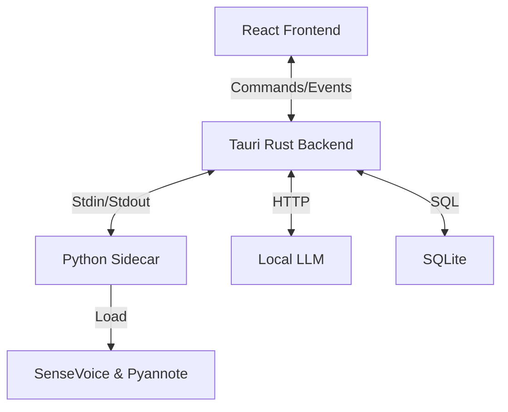

# 🎙️ Local Scribe


[](https://opensource.org/licenses/MIT)


**Local Scribe** is a privacy-first, verified offline meeting assistant tailored for **Apple Silicon**. It records, transcribes, identifies speakers (Diarization), and summarizes conversations—all without sending a single byte of data to the cloud.

---

## ✨ Features

-   **🔒 Privacy First**: All processing happens on-device. No cloud APIs, no data leaks.
-   **🧠 Local AI Stack**:
    -   **STT**: Alibaba's `SenseVoiceSmall` for high-accuracy transcription.
    -   **Diarization**: `pyannote.audio` (v3.1) for distinct speaker identification.
    -   **LLM**: Integrates with local **Ollama** instances (e.g., `qwen2.5-coder`) for summarization.
-   **⚡ Performance**: Built on **Tauri v2** (Rust) for minimal RAM usage (~30MB idle).
-   **🎨 Minimalist UI**: A clean, "Notion-style" interface focused on readability.

## 🛠️ Tech Stack

| Component | Technology | Role |
| :--- | :--- | :--- |
| **Shell** | Tauri v2 (Rust) | Native OS integration, Child Process management |
| **Frontend** | React + TypeScript | UI, State Management, Audio Visualization |
| **Styling** | Tailwind CSS v4 | Minimalist Design System |
| **Sidecar** | Python 3.12 | Runs PyTorch models (SenseVoice, Pyannote) |
| **Database** | SQLite | Local metadata and transcript storage |
| **AI** | Ollama | Local LLM Inference for Summarization |

## 🚀 Getting Started

### Prerequisites

1.  **Node.js** (v18+) & **Rust** (v1.75+)
2.  **Ollama**: Installed and running (`ollama serve`).
    *   Pull a model: `ollama pull qwen2.5-coder:7b` (or similar).
3.  **Hugging Face Token**: Required for Speaker Diarization.
    *   Accept terms for `pyannote/speaker-diarization-3.1`.
    *   Create a `.credentials` file in root: `HF_TOKEN="hf_..."`.

### Installation

```bash
# 1. Clone the repo
git clone https://github.com/your-username/local-scribe.git
cd local-scribe

# 2. Install Frontend Dependencies
npm install

# 3. Setup Python Sidecar
cd sidecar
uv sync  # Uses 'uv' for fast dependency management
# OR
pip install -r requirements.txt

# 4. Run Development Mode
cd ..
npm run tauri dev
```

## 📐 Architecture



## 🛡️ License

MIT © [Your Name]
