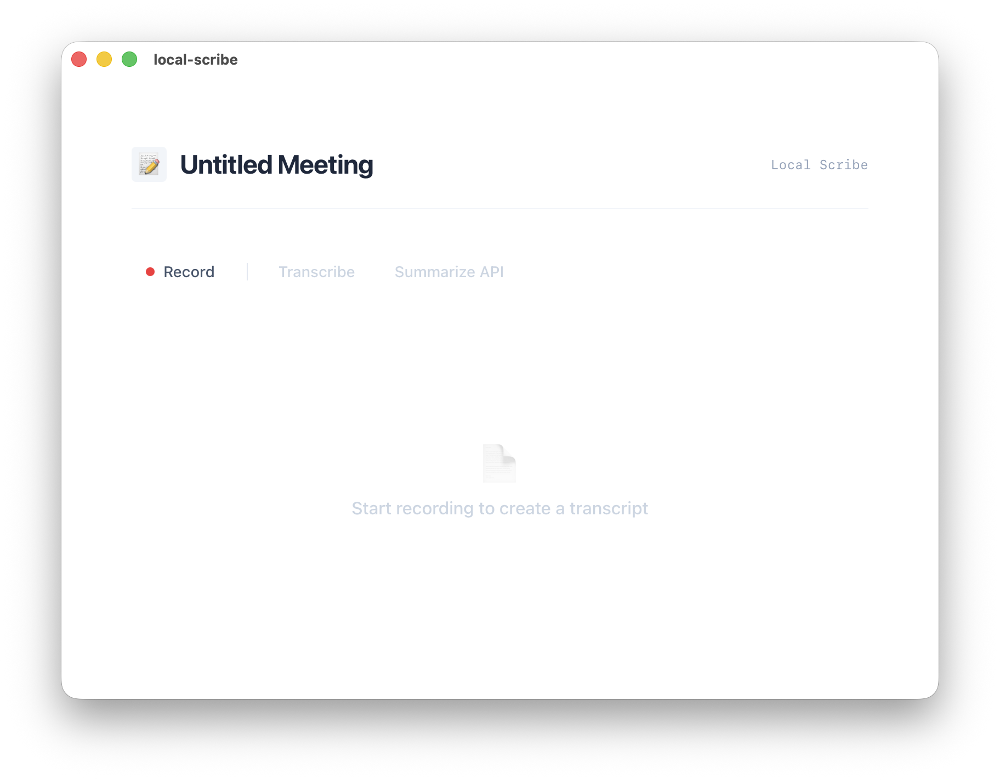
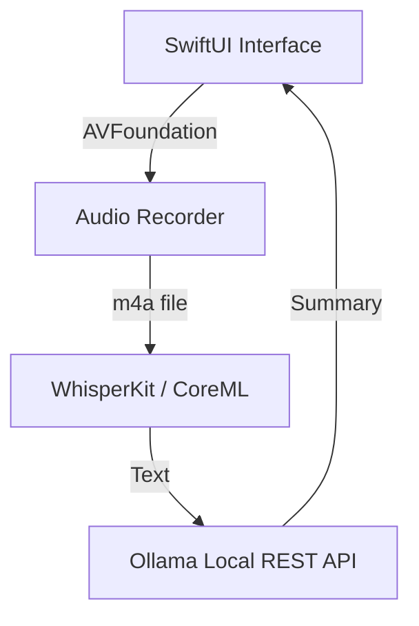

# 🎙️ Local Scribe (Native Apple Silicon Edition)

[](https://opensource.org/licenses/MIT)


**Local Scribe** has been completely rewritten from the ground up to be a blazing-fast, ultra-low memory, native macOS application optimized specifically for **Apple Silicon**.

It records, transcribes, and summarizes conversations entirely offline, using the power of the Apple Neural Engine.


*Minimalist interface showing real-time transcription and speaker identification.*

---

## ✨ Why the Native Rewrite?

The previous version relied on Tauri, React, Python, and PyTorch. This was incredibly resource-heavy (taking GBs of RAM and maxing out CPUs). By rewriting the entire stack natively in Swift:
- **Memory usage dropped drastically** (No more Python runtime or Electron/WebViews).
- **Transcription speed increased massively** by using `WhisperKit` (CoreML inference natively on Apple Silicon).
- **Audio capture is more reliable** via native `AVFoundation`.

## 🛠️ Tech Stack

| Component | Technology | Role |
| :--- | :--- | :--- |
| **App & UI** | Swift & SwiftUI | Native OS integration, minimal memory footprint |
| **Audio** | AVFoundation | Low-level microphone capture (`.m4a`) |
| **Transcription** | WhisperKit (CoreML) | Blazing-fast local STT (`openai_whisper-base`) |
| **Summarization** | Ollama | Local LLM Inference for Summarization |

## 🚀 Getting Started

### Prerequisites

1.  **Xcode 15+** (Required for Swift 5.9 and macOS 14 SDKs)
2.  **Ollama**: Installed and running (`ollama serve`).
    *   Pull a model: `ollama pull qwen2.5-coder:7b` (or similar).

### Installation & Running

This project uses the Swift Package Manager. You do not need Cocoapods or complicated build scripts.

```bash
# 1. Clone the repo
git clone https://github.com/your-username/local-scribe.git
cd local-scribe

# 2. Open in Xcode
open Package.swift

# 3. Build & Run
# Select "LocalScribeApp" as the target and hit Cmd+R (Play Button)
```

## 📐 Architecture


```mermaid
graph TD
    UI[SwiftUI Interface] -->|AVFoundation| Audio[Audio Recorder]
    Audio -->|m4a file| WK[WhisperKit / CoreML]
    WK -->|Text| LLM[Ollama Local REST API]
    LLM -->|Summary| UI
```

## 🛡️ License

MIT © [Alexander Flisiak]
